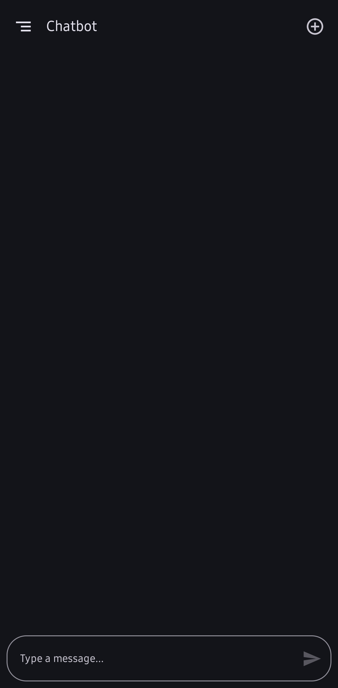
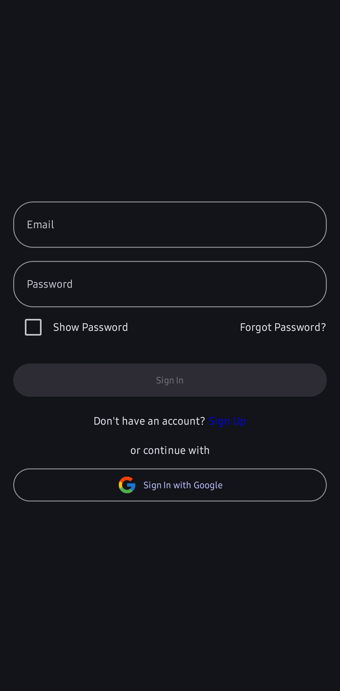

# Chatbot

     
[Chatbot](media/chatbot.mp4)

## 📖 Overview

The **Chatbot App** is a conversational assistant built using the Mistral API for natural language understanding. This app provides seamless interactions and can be customized for various use cases such as customer support, personal assistance, or educational tools.

## Features 

- 🤖 **AI-Powered Conversations**: Built with Mistral's advanced natural language processing.
- 🛠️ **Customizable**: Easily adapt the chatbot responses and behavior to suit your needs.
- 🌐 **Real-Time Communication**: Delivers instant responses for smooth interactions.

## 🛠️ Setup 

### 1. Prerequisites

- **Android Studio** (if you're developing with Jetpack Compose)
- **Mistral API Key**
- Internet connection for API requests
- **Firebase** for Authentication


### 2. Clone the Repository

```bash
git clone https://github.com/pranav5127/Chatbot.git
```

## 🖌️ UI Design

The app uses **Jetpack Compose** for building its Ui, ensuring a modern and responsive user interface.


### Key Components

- Chat Bubble: Displays user and chatbot messages.
- Input Field: Allows users to type messages.
- Send Button: Sends user input to the Mistral API.


## 📧 Support

Feel free to tweak the sections, particularly the examples and instructions, to match your specific implementation!

[MIT LICENSE](LICENSE)
